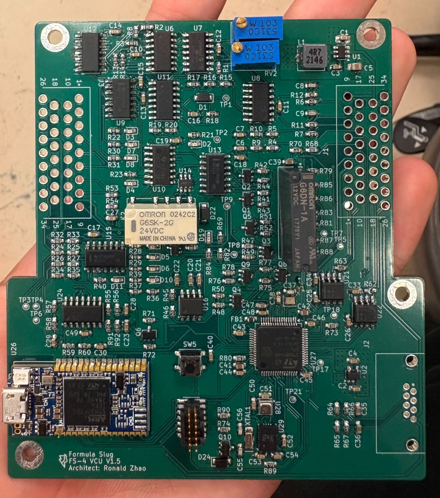
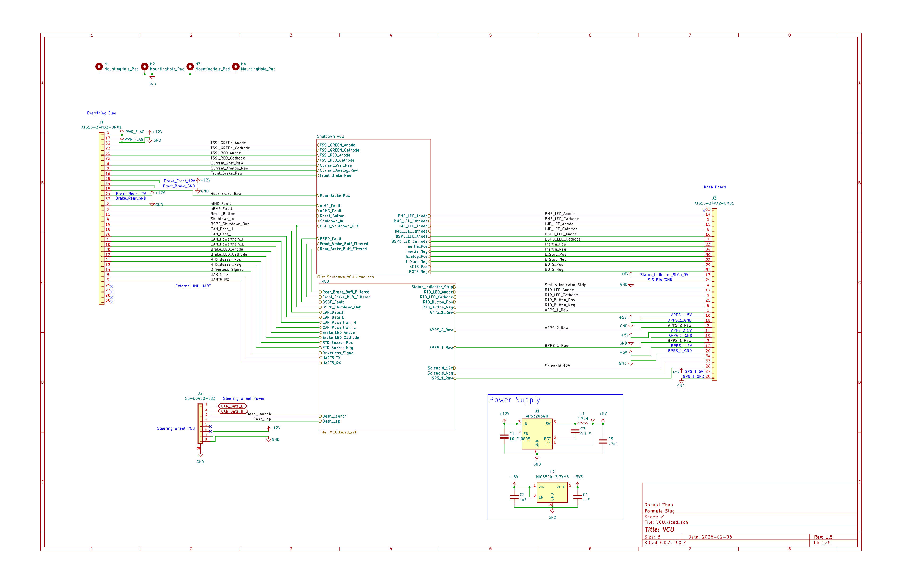
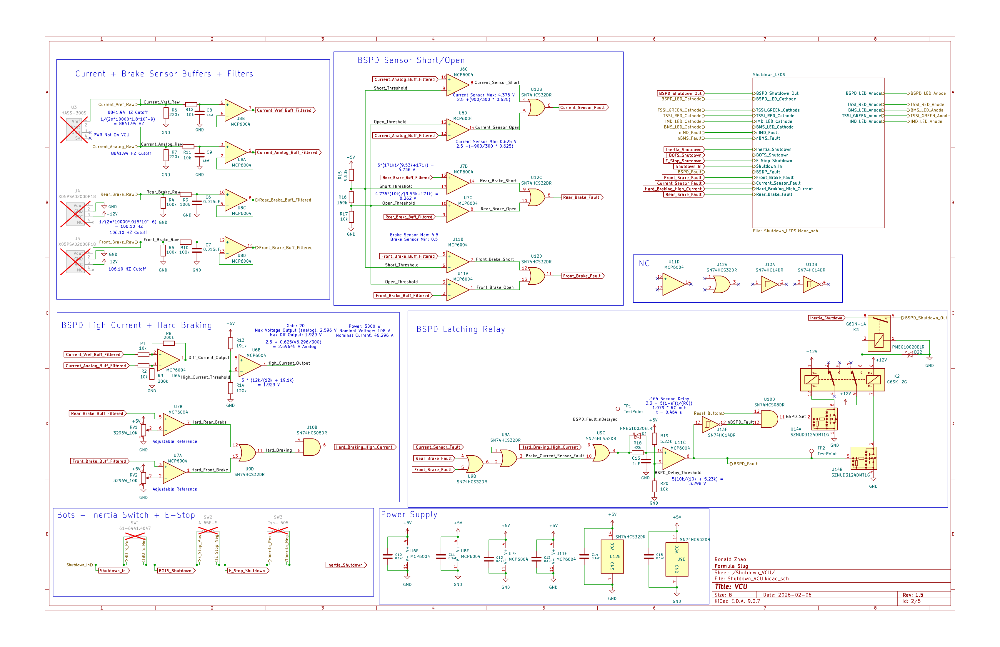
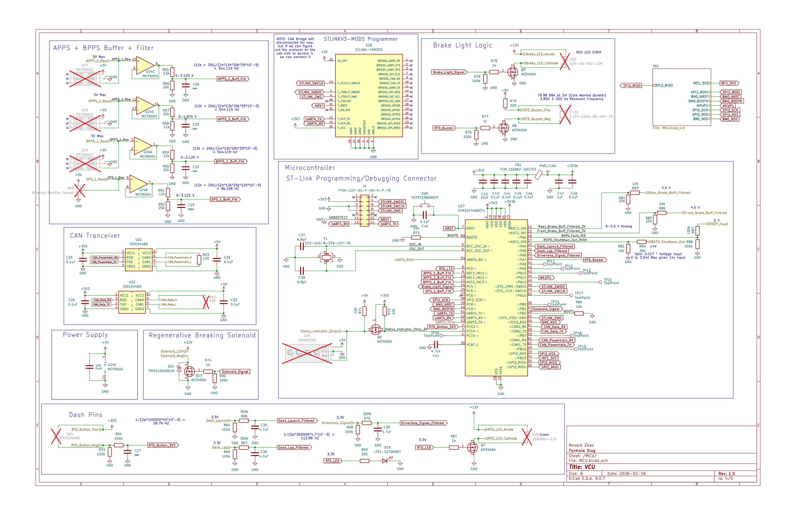
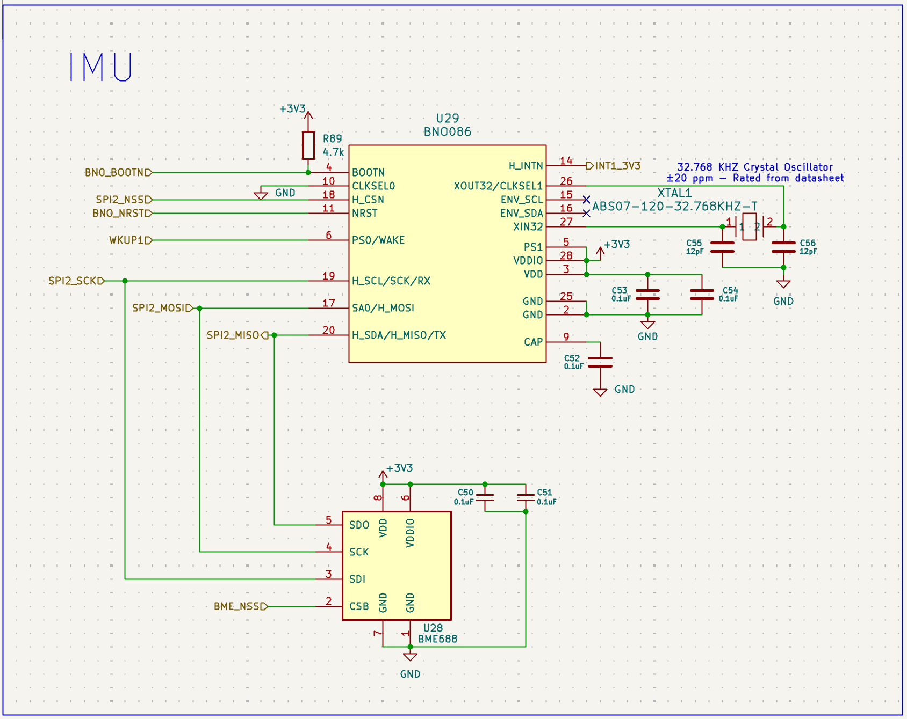
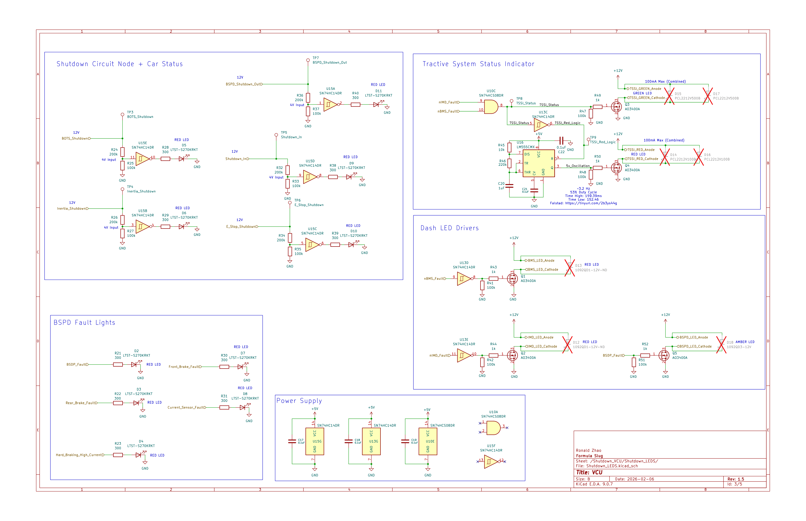
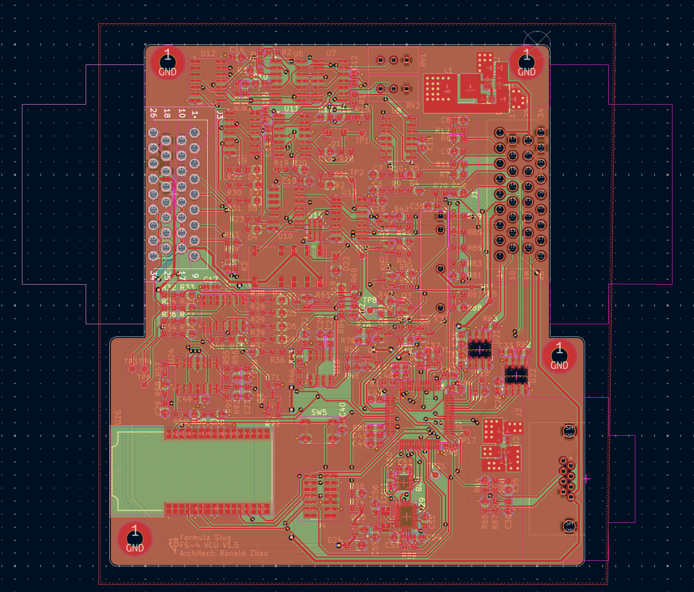
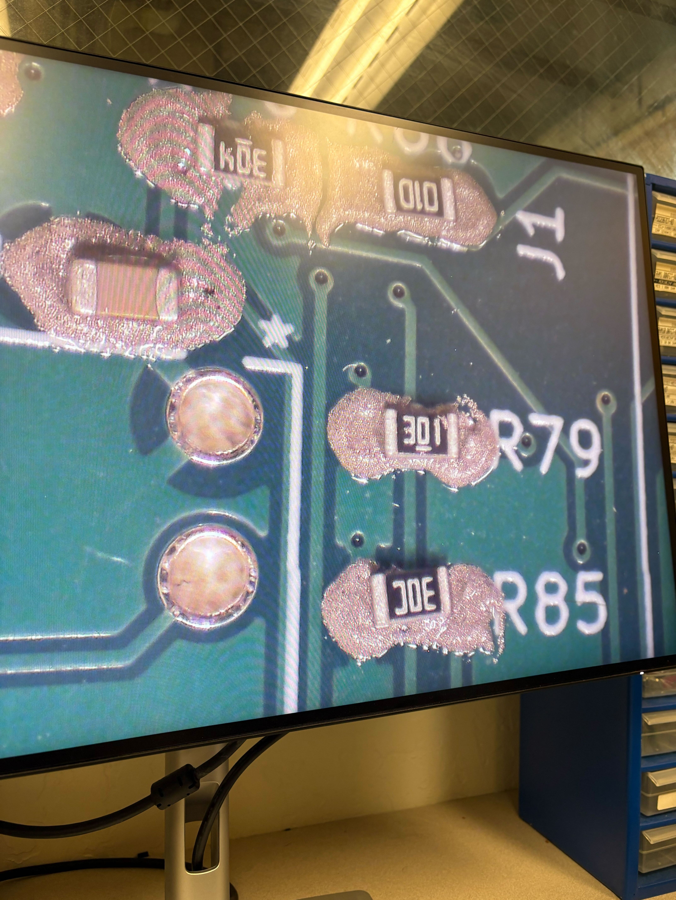

# Vehicle-Control-Unit-PCB Overview
The Vehicle Control Unit PCB (VCU) is a 4-layer PCB designed for the 2025-2026 Formula SAE Competition EV car (FS-4) at UC Santa Cruz. This board serves as the central low-voltage control system for the vehicle and integrates multiple critical functions into a single platform. The board was designed using KiCAD and printed through JLC PCB.
The board mainly serves these purposes:
1. Brake System Plausibility Device (BSPD) and Main Shutdown Circuit:
2. Electronic Throttle Control: Motor control using position pedal sensor inputs
3. Inertial Measurement Unit: Improves FS-4's traction control
4. System Fault Indication: Traction System Status Indicator, ETC.
## PCB

  

## Top Layer Signal Diagram

  

The top layer of my schematic is dedicated to present all of the signals inputs and outputs from each connector. It represents a "block diagram" view of the schematic, containing where each of the 60+ signals go.

## BSPD and Shutdown Circuit

  

The brake system plausibility device is a safety mechanism that detects a high current from the motor and active braking. To detect a high current, the output signal from the HASS-300-S current sensor is each filtered to 8841 Hz and buffered. It is then put through a differential amplifier with a gain of 20 in order to obtain a stable, single ended voltage output, as well as a comparator with a voltage threshold based on the reading of the current sensor at our vehicle's nominal current. Similarly, to detect a hard braking, we filter and buffer signals from a pressure sensor for both the front and rear brake. This is compared to a potentiometer we calibrated based on our driver's voltage reading on the pressure sensor while braking. If both of these requirements are fulfilled, then the circuit will output a high, openning our relay connected to the shutdown circuit. Other cases such as the sensor having a short or open circuit also triggers a fault using a series of comparators and logic gates.

## STM32 Microcontroller

  

The VCU uses the STM32F446RET6 MCU chip with an external 24 MHz crystal oscillator as its clock, instead previous year's development boards (Nucleos) due to space constraints. The electronic throttle control circuit works by taking in two acceleration pedal position sensor and brake pedal position sensor. This signal is processed by the MCU's firmware and sent through CAN to the motor controller. Other signals going into/out the MCU includes:

- Steering position sensor
- Regenerative Braking Solenoid Signal
- Brake Light
- 2x IMU through SPI and UART
- STLINK V3 MODS Debugger
- Test Points
- Fault Signals

## Inertial Measurement Unit

  

The Inertial Measurement Unit is made up of two sensors to make up the accelerometer, gyroscope, and magnetometer. The IMU uses SPI for its data transfer between the chip and the MCU. Previously our vehicle's traction control was configured to compare the front and rear wheel speed to detect slipping, through our peripheral boards. However, since it requires CAN, the limited bus usage causes the sampling to only be at 100 Hz. This creates a delay and is not practical for quick motor output adjustments. Using the IMU, we can compare both the motor torque output with the car's acceleration (should be proportional) and the steering position sensor's reading with the angular velocity of the car. Since the IMU uses SPI, the sampling rate isn't limited by CAN and has the potential to make precise adjustments.

## Fault Indicators

  

Fault indicators, such as the Tractive System Status Indicator (TSSI), are required by Formula SAE to signal critical failures in safety-related systems. They also provide a fast method for debugging faults because of their easily accessable test points. These fault lights include:

- IMD
- BMS
- BSPD
- Inertia Switch
- BOTS Switch

## PCB Layout

  

The layout was done in KiCAD and took almost 6 revisions. It is a 4-layer board with a signal-GND-PWR-signal layer configuration. I started the process by laying out my connectors based on the direction of each respective connectors' signals. Then, I layed out the high speed signals, such as the SPI signal, in a low noise area (far away from DCDC). I kept the traces as short as possible and provided a short return path to reduce the closed loop inductance. The hardest part was placing down my op amps due to the sheer amount of them. To prevent signals crossing, I would often switch the op amp inputs in my schematic. The final design was approved in late February. The end product was a 4x4 inch pcb with over 200 components.

## Soldering, Testing, and Debugging

  

One of the hardest parts of the process was soldering and debugging the board. Almost all of our passive components were 0603 and were entirely hand soldered and the process took over 8 hours. I debugged the board primarily through following my test plan, which you can find here: 

[Test Plan](https://[your-long-link.com](https://docs.google.com/document/d/1dWHqh_tH-KAfCqI4JE5uINjZ180YYHxUwMFZACGtfho/edit?usp=sharing))

Many of the faults included shorts from the microcontroller and STLINKV3 due to their small pad size. 

## Closign Remarks
This was definitely the biggest, most complex, and my proudest project to date! If you have any questions email me at: ronaldzhao17@gmail.com
